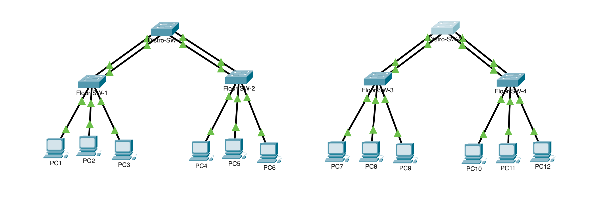
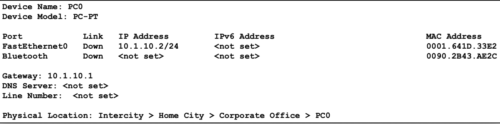

# IT&C 247 - Lab 1		
   
## Introduction

Welcome to your first lab in IT&C 247! In this lab, we will delve into the fundamentals of configuring network infrastructure that encompasses IP addressing, VLANs (Virtual Local Area Networks), floor switches, distribution switches, various port modes including access and trunk, as well as port channels for improved bandwidth and redundancy.

## Objectives

The primary objective of this lab is to familiarize ourselves with the configuration and deployment of key layer 2 networking components using Cisco Packet Tracer. By the end of this lab, you should be able to:

1. Configure IP addresses on PCs and switches.
1. Implement VLANs to logically segment the network.
1. Set up floor switches and distribution switches to manage network traffic efficiently.
1. Configure port modes including access and trunk to control traffic flow.
1. Create port channels to aggregate bandwidth and enhance redundancy.

## Network Tables

We will be working with a simplified network topology comprising PCs, floor switches, distribution switches, and connections between them. The topology will mimic a small-scale enterprise network, allowing us to implement various configurations effectively. Make sure you name the devices exactly as listed in the instructions(casing and spaces included) or the autograder will not be able to grade it.




This table contains all of the network information you will need to set up the network for Lab 1. The IP address, gateway, and subnet will be set on the PC objects while the VLANs will be set on the switches.

| PC Name |	IP Address	| Gateway | Subnet | VLAN |
| - | - | - | - | - |  
| PC1	| 10.1.10.2 | 10.1.10.1 | /24 | 10	
| PC2	| 10.1.11.2 | 10.1.11.1 | /24 | 11	
| PC3	| 10.1.12.2 | 10.1.12.1 | /24 | 12	
| PC4	| 10.1.10.3 | 10.1.10.1 | /24 | 10	
| PC5	| 10.1.10.4 | 10.1.10.1 | /24 | 10
| PC6	| 10.1.12.3 | 10.1.12.1 | /24 | 12	
| PC7	| 10.2.13.2	| 10.2.13.1	| /24 | 13	
| PC8	| 10.2.14.2	| 10.2.14.1	| /24 | 14	
| PC9	| 10.2.15.2	| 10.2.15.1	| /24 | 15	
| PC10 | 10.2.13.3	| 10.2.13.1	| /24 | 13	
| PC11 | 10.2.14.3	| 10.2.14.1	| /24 | 14	
| PC12 | 10.2.15.3	| 10.2.15.1	| /24 | 15

| Switch Name |	IP Address | Subnet | VLAN |  
| - | - | - | - |  
| Floor-SW-1	| 10.1.11.3 | /24 | 11
| Floor-SW-2	| 10.1.11.4 | /24 | 11	
| Floor-SW-3	| 10.2.11.3 | /24 | 11	
| Floor-SW-4	| 10.2.11.4 | /24 | 11	
| Distro-SW-1	| 10.1.11.5 | /24 | 11	
| Distro-SW-2	| 10.2.11.5 | /24 | 11	

| VLAN | IP Range |
| - | - |
| 10 | 10.1.10.0/24 |
| 11 | 10.1.11.0/24 |	
| 12 | 10.1.12.0/24 |	
| 13 | 10.2.13.0/24 |	
| 14 | 10.2.14.0/24 | 	
| 15 | 10.2.15.0/24 | 


| Switch       | Switch Interface | End Device | End Device Interface |
| ------------ | ---------------- | ---------- | ---------------------| 
| Floor-SW-1   | Fa1              | PC1        | Fe0                  |
| Floor-SW-1   | Fa2              | PC2        | Fe0                  |
| Floor-SW-1   | Fa3              | PC3        | Fe0                  |
| Floor-SW-2   | Fa1              | PC4        | Fe0                  |
| Floor-SW-2   | Fa2              | PC5        | Fe0                  |
| Floor-SW-2   | Fa3              | PC6        | Fe0                  |
| Floor-SW-3   | Fa1              | PC7        | Fe0                  |
| Floor-SW-3   | Fa2              | PC8        | Fe0                  |
| Floor-SW-3   | Fa3              | PC9        | Fe0                  |
| Floor-SW-4   | Fa1              | PC10       | Fe0                  |
| Floor-SW-4   | Fa2              | PC11       | Fe0                  |
| Floor-SW-4   | Fa3              | PC12       | Fe0                  |


| Floor Switch | Switch Interface | Floor Switch Port Channel | Distro Switch | Distro Switch Interface | Distro Switch Port Channel |
| ------------ | ---------------- | ------------------------- | --------------| ----------------------- | -------------------------- |
| Floor-SW-1   | Fa23             | Po1                       | Distro-SW-1   | Fa23                    | Po1                        |
| Floor-SW-1   | Fa24             | Po1                       | Distro-SW-1   | Fa24                    | Po1                        |
| Floor-SW-2   | Fa21             | Po1                       | Distro-SW-1   | Fa21                    | Po2                        |
| Floor-SW-2   | Fa22             | Po1                       | Distro-SW-1   | Fa22                    | Po2                        |
| Floor-SW-3   | Fa23             | Po1                       | Distro-SW-2   | Fa23                    | Po1                        |
| Floor-SW-3   | Fa24             | Po1                       | Distro-SW-2   | Fa24                    | Po1                        |
| Floor-SW-4   | Fa21             | Po1                       | Distro-SW-2   | Fa21                    | Po2                        |
| Floor-SW-4   | Fa22             | Po1                       | Distro-SW-2   | Fa22                    | Po2                        |


## PC Configuration 

The PC device in Cisco Packet Tracer is located under the "End Devices" category, accessible via the navigation panel on the left-hand side of the interface. You will need 12 PCs as shown in the network diagram.

**Configuring IP Address:**

1. To configure the IP address of a PC, click on the PC object within the Packet Tracer workspace.
1. After selecting the PC, navigate to the "Desktop" tab located in the contextual panel on the right-hand side of the interface. From there, choose the "IP Configuration" option.
1. In the IP Configuration dialog, enter the desired IPv4 address in the provided field. This address should be within the designated subnet for the network. For example, if the subnet is 192.168.1.0/24, a valid IP address could be 192.168.1.10. Use the `Network` table above to work out what the IP address, subnet, and default gateway should be for each PC.
1. Once the IP configuration is entered, the settings will automatically save. There's no need to explicitly save the configuration manually.

**Example Configuration:**

For example, let's configure the IP settings for PC1:

- **IPv4 Address:** 10.1.10.2
- **Subnet Mask:** 255.255.255.0
- **Default Gateway:** 10.1.10.1


**Visual Representation:**

After configuring the IP settings, the PC icon in the Packet Tracer workspace will display network information when hovered over. This information includes the configured IP address, subnet mask, and default gateway.



You will need to repeat this process for all 12 PCs. 

## Switch

Once all the PCs have been created in your network topology, the next step is to add switches and establish connections among all devices. In this lab, we will be using the Cisco Catalyst 2960 switch, which can be found under the `Network Devices` category, specifically under `switches`. It will have the label `2960`. You will need 6 switches total as shown in the network diagram.

### Adding Switches

1. Navigate to the "Network Devices" category in Cisco Packet Tracer, then select "Switches," and finally choose "2960" from the available options.

2. Click anywhere within the Packet Tracer workspace to place the switch.

3. Repeat the process to add additional switches as required for the network topology.

### Cable Configuration

Now that all the devices in the topology are present, you will need to connect them as shown in the topology image. 

#### Locating Cables

1. Cables can be found under the lightning bolt icon located on the bottom left-hand side of the Packet Tracer interface.

2. We'll be using the `Copper Straight-Through` cable, which is the third cable from the right in the cable panel. It is identifiable by its icon featuring a solid black diagonal line.

#### Establishing Connections

   1. Click on the `Copper Straight-Through` cable icon to select it.
   1. Position the cursor over the first device you want to connect.
   1. Click on the selected device to initiate the connection process.
   1. Choose the interface you want to connect the cable to. For PCs, the connection will typically be made to `FastEthernet0`.
   1. For switches, select the specific `FastEthernet0/x` port to connect the cable.
   1. Repeat the process for the second device you want to connect, selecting the appropriate interface or port.

**Example:**

Suppose you want to connect PC1 to a switch using a `Copper Straight-Through` cable:

1. Click on the Copper Straight-Through cable icon in the cable panel.
1. Position the cursor over PC1.
1. Click on PC1 to initiate the connection.
1. Select the `FastEthernet0` interface on PC1.
1. Position the cursor over the desired port on the switch.
1. Click on the switch to complete the connection.
1. Select the appropriate `FastEthernet0/1` port on the switch.


### Connecting Devices Together

Now that all the physical connections have been made between all the devices. It is time to program the switches so the correct devices can communicate with each other.

1. **Accessing Configuration Mode:** To configure the switches, enter configuration mode. You can achieve this by following these commands:

   ```
   enable
   configure terminal
   ```

   This will take you to the global configuration mode.
    - Note: If you have already entered the `configure terminal` command you do not need to enter it again 

1. **Configuring VLANs**

   ```
   configure terminal
   vlan <VLAN number>
   name <VLAN name>
   ```
    Replace `<VLAN number>` with the desired VLAN ID and `<VLAN name>` with a descriptive name for the VLAN. 

   Now is the time you will have to configure your (SVI)s which stands for Switched Virtual Interface. These are routed interfaces representing the IP addressing scheme for a specific network VLAN connected to this interface.

   Follow the steps for configuring the VLAN above then follow these steps:

   ```
   configure terminal
   interface vlan <VLAN number>
   ip address <SVI address> <SVI subnet>
   no shutdown
   ```

1. **Configuring A Switch**

   - **Access Mode:**

     - When do I use `switchport mode access`?
        - Port mode Access configures switch ports to connect end devices, assigning each port to a specific VLAN for traffic isolation. It ensures that frames transmitted and received on the port are untagged, allowing seamless communication within the designated VLAN. This mode is commonly used for connecting PCs, printers, or servers to switches.
      - Click on the Switch you want to configure and click on the `CLI` tab at the top, then enter these commands.
         - Note: You will need to be in global configuration mode first. 
     ```
     interface FastEthernet0/<port number>
     switchport mode access
     switchport access vlan <VLAN number>
     ```

     - Replace `<port number>` with the specific port number on the switch and `<VLAN number>` with the VLAN ID to which the port will belong.

   - **Trunk Mode:**

     - When do I use `switchport mode trunk`?
        - Switchport mode trunk enables the transmission of traffic for multiple VLANs across a single physical connection. Trunk ports use VLAN tagging to differentiate between VLANs, allowing devices connected to the port to communicate across different VLANs. This mode is essential for interconnecting switches, routers, or other network devices in environments where multiple VLANs exist.

     ```
     interface FastEthernet0/<port number>
     switchport mode trunk
     switchport trunk allowed vlan <VLAN numbers>
     ```
    
     - Replace `<port number>` with the specific port number on the switch and `<VLAN numbers>` with a comma-separated list of VLAN IDs that are allowed on the trunk.


   - **Port Channels**

        - Link Aggregation Control Protocol (LACP) is a networking protocol used to dynamically negotiate and manage the bundling of multiple physical links into a single logical link, known as a port channel or EtherChannel.

        - The commands for this section you will have to research yourself but the protocol you will want to use is LACP.

   - **Saving Your Config**

      - By default managed switches do not save the changes you make automatically. To save the config use the command `copy running-config startup-config`

#### Utilizing Command-Line Help

If you're unsure about a particular command or its usage, you can always utilize the '?' symbol to access context-sensitive help. For example, typing `switchport mode ?` will display available options for switchport modes.

#### Debugging and configs

1. `show vlan`
   - This command displays information about VLANs configured on the device, including VLAN IDs, names, and associated interfaces. It provides a detailed view of VLAN configurations and assignments on the switch.

1. `show vlan brief`
   - This command provides a summarized view of VLAN information, including VLAN IDs, names, and the number of active ports in each VLAN. It offers a quick overview of VLAN configurations and assignments without the additional details provided by the full `show vlan` command.

1. `show int`
   - This command provides detailed information about all interfaces on the device, including their status, configuration, and statistics. It displays information such as interface type, status (up/down), speed, duplex settings, and traffic statistics.

1. `show int brief`
   - This command provides a summarized view of interface information, displaying only essential details such as interface name, status (up/down), and IP address (if configured). It offers a quick overview of interface statuses without the additional details provided by the full `show int` command.

1. `show run`
   - This command displays the current running configuration of the device, showing all configuration commands that are currently active and applied to the device. It provides a comprehensive view of how the device is configured.

These commands are commonly used for troubleshooting, configuration verification, and monitoring network performance. They provide valuable insights into the current state and configuration of the device and its interfaces.


#### Example Commands

Here are some examples of configuring ports for both access and trunk modes:

- **Access Mode**
  ```
  interface FastEthernet0/1
  switchport mode access
  switchport access vlan 10
  ```

- **Trunk Mode**
  ```
  interface FastEthernet0/24
  switchport mode trunk
  switchport trunk allowed vlan 10,20,30
  ```

## Write Up Questions

1. What layer does a switch operate on?
1. What layer does a VLAN operate on?
1. Why are the PCs in different VLANs not able to ping each other?
1. Why can you ping PCs in the same VLAN without a router?
1. What is the difference between access and trunk?
1. What is a port channel? When is it used and why?

## TA Pass Off Requirements

- Device connectitivy (this includes switches)
   - All devices in the same VLAN can ping each other
   - Devices not in the same VLAN can not ping each other
- All Trunk connections between floor and distro switches only allow the required VLANs across them (5 Points)
- All Trunk connections are in a port channel using `mode active` and `LACP` as the protocol (5 Points)
- All PCs have the correct IP Address, Gateway and Subnet Mask

## Lab Submission

- Cisco Packet Tracer will auto grade your lab and tell you if all requirments have been met. When you have finished upload the Packet Tracer File and the write up questions to Learning Suite. The write-up questions must be submitted to Learning Suite as a PDF document.
