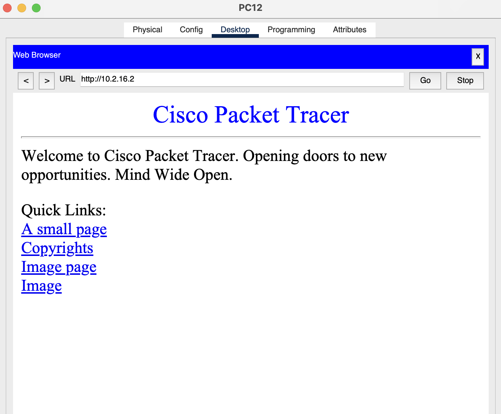

# IT&C 247 - Lab 2   

## Introduction

In this lab, we will delve into the fundamentals of configuring layer 3 network infrastructure and some review for layer 2. We'll cover setting up routers, an access point with connected laptops, and a server hosting a website. 

## Objectives

1. Establish routing between VLANs by configuring two core routers to facilitate traffic flow.
1. Deploy an access point with a defined SSID and password for wireless connectivity.
1. Connect three laptops to the access point to enable network access.
1. Set up a web server hosting a basic webpage to serve content within the network.

## Network Tables

We will be working with the same base topology you created in lab 1 and adding to it. You will be adding 2 routers, an access point (AP), 3 laptops, and a server.

These tables contain all of the network information you will need to set up the network for Lab 2. They are the same tables from lab 1 just with the extra devices added.

| PC Name | IP Address  | Gateway | Subnet | VLAN |  
| - | - | - | - | - |  
| PC1 | 10.1.10.2 | 10.1.10.1 | /24 | 10  
| PC2 | 10.1.11.2 | 10.1.11.1 | /24 | 11  
| PC3 | 10.1.12.2 | 10.1.12.1 | /24 | 12  
| PC4 | 10.1.10.3 | 10.1.10.1 | /24 | 10  
| PC5 | 10.1.10.4 | 10.1.10.1 | /24 | 10  
| PC6 | 10.1.12.3 | 10.1.12.1 | /24 | 12  
| PC7 | 10.2.13.2 | 10.2.13.1 | /24 | 13  
| PC8 | 10.2.14.2 | 10.2.14.1 | /24 | 14  
| PC9 | 10.2.15.2 | 10.2.15.1 | /24 | 15  
| PC10   | 10.2.13.3 | 10.2.13.1 | /24 | 13  
| PC11   | 10.2.14.3 | 10.2.14.1 | /24 | 14  
| PC12   | 10.2.15.3 | 10.2.15.1 | /24 | 15
| SRV1 | 10.2.16.2 | 10.2.16.1 | /24 | 16
| LT1  | 10.1.10.5 | 10.1.10.1 | /24 | 10
| LT2  | 10.1.10.6 | 10.1.10.1 | /24 | 10
| LT3  | 10.1.10.7 | 10.1.10.1 | /24 | 10

| Switch Name |   IP Address | Subnet | VLAN |  
| - | - | - | - |  
| Floor-SW-1   | 10.1.11.3 | /24 | 11
| Floor-SW-2   | 10.1.11.4 | /24 | 11  
| Floor-SW-3   | 10.2.11.3 | /24 | 11  
| Floor-SW-4   | 10.2.11.4 | /24 | 11  
| Distro-SW-1  | 10.1.11.5 | /24 | 11  
| Distro-SW-2  | 10.2.11.5 | /24 | 11  

| VLAN | IP Range |
| - | - |
| 10 | 10.1.10.0/24 |
| 11 | 10.1.11.0/24 |
| 11 | 10.2.11.0/24 |	
| 12 | 10.1.12.0/24 |	
| 13 | 10.2.13.0/24 |	
| 14 | 10.2.14.0/24 | 	
| 15 | 10.2.15.0/24 | 
| 16 | 10.2.16.0/24 |

| Switch       | Switch Interface | End Device | End Device Interface |
| ------------ | ---------------- | ---------- | ---------------------| 
| Floor-SW-1   | Fa1              | PC1        | Fa0                  |
| Floor-SW-1   | Fa2              | PC2        | Fa0                  |
| Floor-SW-1   | Fa3              | PC3        | Fa0                  |
| Floor-SW-2   | Fa1              | PC4        | Fa0                  |
| Floor-SW-2   | Fa2              | PC5        | Fa0                  |
| Floor-SW-2   | Fa3              | PC6        | Fa0                  |
| Floor-SW-2   | Fa4              | AP         | Port0                |
| Floor-SW-3   | Fa1              | PC7        | Fa0                  |
| Floor-SW-3   | Fa2              | PC8        | Fa0                  |
| Floor-SW-3   | Fa3              | PC9        | Fa0                  |
| Floor-SW-4   | Fa1              | PC10       | Fa0                  |
| Floor-SW-4   | Fa2              | PC11       | Fa0                  |
| Floor-SW-4   | Fa3              | PC12       | Fa0                  |
| Floor-SW-4   | Fa4              | SRV        | Fa0                  |

| Floor Switch | Switch Interface | Floor Switch Port Channel | Distro Switch | Distro Switch Interface | Distro Switch Port Channel |
| ------------ | ---------------- | ------------------------- | --------------| ----------------------- | -------------------------- |
| Floor-SW-1   | Fa23             | Po1                       | Distro-SW-1   | Fa23                    | Po1                        |
| Floor-SW-1   | Fa24             | Po1                       | Distro-SW-1   | Fa24                    | Po1                        |
| Floor-SW-2   | Fa21             | Po1                       | Distro-SW-1   | Fa21                    | Po2                        |
| Floor-SW-2   | Fa22             | Po1                       | Distro-SW-1   | Fa22                    | Po2                        |
| Floor-SW-3   | Fa23             | Po1                       | Distro-SW-2   | Fa23                    | Po1                        |
| Floor-SW-3   | Fa24             | Po1                       | Distro-SW-2   | Fa24                    | Po1                        |
| Floor-SW-4   | Fa21             | Po1                       | Distro-SW-2   | Fa21                    | Po2                        |
| Floor-SW-4   | Fa22             | Po1                       | Distro-SW-2   | Fa22                    | Po2                        |

| Distro Switch | Distro Switch Interface | Router Number| Router Interface |
| ------------- | ------------------------| -------------| ---------------- |
| Distro-SW-1   | Gig 0/1                 | Router-1     | Gig 0/1/0        |
| Distro SW-2   | Gig 0/1                 | Router-2     | Gig 0/1/0        |

## Routers

### Adding a Switch Module to the Router

1. **Accessing the Router:**
   - Navigate to `Network Devices > Routers` in Cisco Packet Tracer.
   - Locate the `4331` router object.

1. **Adding the Switch Module:**
   - By default, the router lacks the necessary module to connect a switch.
   - To customize the hardware, click on the router object and go to the `Physical` tab.

1. **Turning Off the Router:**
   - Before making any changes, turn off the router using the power button located on the bottom right corner of the router view.

1. **Adding the Module:**
   - Drag the `NIM-ES2-4` module from the `MODULES` menu to any of the empty slots on the top row of the router view.

1. **Turning On the Router:**
   - After adding the module, turn the router back on.

### Configuring the Connection Between the Router and Switch

1. **Setting Up Connection:**
   - Now that the module is installed, you can configure the connection between the Dist switch and the router to allow routing between the VLANs.

1. **Connection Type:**
   - Determine the type of connection needed between the router and switch: Access or Trunk.
     - Access: If each VLAN on the switch needs to correspond to a separate subnet on the router.
     - Trunk: If multiple VLANs on the switch need to be carried over a single connection to the router.

1. **Enabling VLAN Communication:**
   - Ensure that VLANs can communicate with each other by configuring appropriate routing on the router.
   - Consider the IP information assigned to each device in the network and which part you haven't used or set up yet to ensure that routing between VLANs is configured to allow communication.

## Access Points (APs)

### Configuring SSID and Security Settings on the Access Point

1. **Accessing the Access Point:**
   - Navigate to `Network Devices > Wireless Devices` in Cisco Packet Tracer.
   - Locate the `AP-PT` device.

1. **Configuring SSID and Security:**
   - Access the settings or configuration options of the Access Point.
   - Set up the SSID (Service Set Identifier) for the wireless network. This is the name that will be visible to users when they search for available networks.
   - Configure security settings:
     - Choose the appropriate security protocol (e.g., WPA2-PSK, WPA3-PSK).
     - Set a strong, secure password for the wireless network to prevent unauthorized access.

### Connecting the Access Point to Floor Switch 2

1. **Connecting Hardware:**
   - Physically connect the Access Point to one of the ports on Floor Switch 2 using an Ethernet cable.

1. **Configuring VLAN Traffic:**
   - Ensure that VLAN traffic for VLAN 10 can traverse the connection between the switch and AP.
   - Access the configuration options of Floor Switch 2.
   - Configure the port to which the Access Point is connected to be a member of VLAN 10.
   - Verify that the port is configured as a access port if VLAN 10 traffic needs to traverse it.

## Laptops

### Swapping NIC for WNIC on the Laptop

1. **Accessing the Laptop:**
   - Navigate to `End Devices` in Cisco Packet Tracer.
   - Locate the `Laptop` object.

1. **Swapping NIC:**
   - By default, the Laptop comes with an Ethernet port, but for wireless connectivity, you need to swap it for a Wireless Network Interface Card (WNIC).
   - Click on the Laptop object and go to the `Physical` tab.

1. **Turning Off the Laptop:**
   - Before making any changes, turn off the Laptop using the power button on the left side of the side view. The power button typically has a green light underneath it.

1. **Swapping NICs:**
   - Locate the NIC on the Laptop. It's typically situated in the center of the laptop's side view.
   - Click and hold on to the NIC, then drag it off to the modules section on the left-hand side. This action will create an empty slot where the NIC was previously installed.
   - From the modules menu, drag the `WPC300N` Wireless Network Interface Card to the empty slot on the Laptop.

 ### Configuring IP Settings and Connecting to Wireless Network

1. **Powering On the Laptop:**
   - Power the laptop back on.

1. **Configuring IP Settings:**
   - Access the network settings or configuration options on the laptop.
   - Configure the IP settings, including IP address, subnet mask, and gateway.

1. **Connecting to Wireless Network:**
   - Search for available wireless networks on the laptop.
   - Select the SSID (Service Set Identifier) of the wireless network set up in the previous step.
   - Enter the password for the wireless network.

## Server

### Attaching the Server to Floor Switch 4

1. **Accessing the Server:**
   - Navigate to `End Devices` in Cisco Packet Tracer.
   - Locate the `Server` object.

1. **Connecting the Server:**
   - Physically attach the Server to `Floor Switch 4` using an Ethernet cable.

### Verifying Web Server Status

1. **Checking Web Server Status:**
   - Click on the Server object and navigate to the `Services` > `HTTP` tab.
   - Verify that the radio button next to the HTTP service indicates that the server is `On`, indicating that the web server is running.

### Configuring IP Settings

1. **Setting IP Address, Subnet Mask, and Gateway:**
   - Access the network settings or configuration options on the Server.
   - Configure the following network parameters:
     - IP address: Assign a unique IP address to the Server within the subnet.
     - Subnet mask: Set the subnet mask according to the network's subnetting scheme.
     - Gateway: Specify the IP address of the default gateway, typically the router's interface connected to the Server's subnet.

### Testing Web Server Functionality

1. **Accessing the Web Server:**
   - From any PC on the same side of the network as the Server, open a web browser.
   - Enter the IP address of the Server in the browser's address bar.
        - Ensure that the router is configured to route traffic between the VLAN of the PC being used and the subnet where the web server resides.

1. **Accessing Website:**
   - Based on the settings on the Web server, ensure you use the correct protocol (HTTP or HTTPS) to access the website.
   - If the web server is functioning correctly, the browser should display a page similar to the one shown in the provided image.

## Write Up Questions

1. What layer does a router operate on?
1. What layer does WIFI operate on?
1. Why are you now able to ping between VLANs? What are the security implications of this?
1. What is the difference between WPA, WEP, and WPA2?
1. Why did you have to add a module to the router to allow it to communicate with the switch

## TA Pass Off Requirements

- PC1(10.1.10.2) can ping (40 Points):
   - PC4(10.1.10.3)
   - PC5(10.1.10.4)
   - PC2(10.1.11.2)
   - PC3(10.1.12.2)
   - PC6(10.1.12.3)
   - LT1(10.1.10.5)
   - LT2(10.1.10.6)
   - LT3(10.1.10.7)
- PC7(10.2.13.2) can ping (40 Points): 
   - PC10(10.2.13.3)
   - PC8(10.2.14.2)
   - PC11(10.2.14.3)
   - PC9(10.2.15.2)
   - PC12(10.2.15.3)
   - SRV1(10.2.16.2)
- You can access the webpage through the web browser of any PC in the same network as the web server. (10 Points)
- The AP should use the best encryption available and have a strong password. (10 Points)

## Lab Submission

- This lab will be passed off in person with a TA. The write-up questions must be submitted to Learning Suite as a PDF document.
