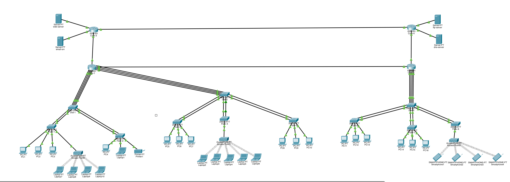

# IT&C 247 - Lab 5 - Troubleshooting

## Introduction

In this lab, you will troubleshoot a complex network environment that includes PCs, printers, smartphones, access points (APs), switches, routers, and a suite of servers such as web, mail, DNS, and FTP servers. The network uses OSPF for dynamic routing to ensure efficient and reliable communication across the infrastructure. Your task will be to diagnose and resolve connectivity issues, misconfigurations, and service disruptions, focusing on ensuring all components interact seamlessly. You will examine device configurations, verify OSPF operations, check server accessibility, and ensure that all end-user devices can successfully connect and utilize network resources.

## Objectives

- Diagnose and resolve network connectivity issues among PCs, printers, smartphones, access points (APs), switches, and routers.
- Verify and troubleshoot OSPF configuration and operations to ensure efficient routing.
- Ensure seamless communication and interaction between all network devices and services.
- Check and resolve access issues with web, mail, DNS, and FTP servers.
- Examine and correct device configurations for proper network integration.
- Confirm end-user devices can successfully connect to and utilize network resources.
- Identify and rectify any service disruptions affecting network performance.
- Maintain network security and stability throughout the troubleshooting process.

## Topology

This is the network topology you will be working with. The network contains:

- 16 x PCs
- 10 x Laptops
- 4 x Smartphones
- 3 x Access Points
- 8 x Floor Switches
- 3 x Distro Switches
- 4 x Core Routers
- 1 x Mail Server
- 1 x Web Server
- 1 x FTP Server
- 1 x DNS Server

Your task will be to debug the network and get it working as the below specifications dictate. Not everything in the network will be malfunctioning or not working in some way, but it will take considerable time to debug the network. This lab is designed to be done in pairs but you can work alone if you choose to do so.

These tables contain all of the network information you will need to set up the network for Lab 5.

#### Network Zone 0
| Device Name | IP Address  | Gateway | Subnet | VLAN |  
| - | - | - | - | - |  
| PC1  | 10.199.0.2 | 10.199.0.1 | /24 | 199 
| PC2  | 10.10.0.2  | 10.10.0.1  | /24 | 10  
| PC3 | 10.10.0.3 | 10.10.0.1| /24 | 10  
| PC4  | 10.199.0.3 | 10.199.0.1 | /24 | 199 
| PC5 | 10.10.0.4 | 10.10.0.1 | /24 | 10  
| PC6  | 10.199.0.4 | 10.199.0.1 | /24 | 199
| PC7 | 10.10.0.5 | 10.10.0.1 | /24 | 10 
| PC8 | 10.10.0.6 | 10.10.0.1 | /24 | 10  
| PC9 | 10.10.0.7 | 10.10.0.1 | /24 | 10  
| PC10 | 10.199.0.5 | 10.199.0.1  | /24 | 199
| Laptop1  | 10.10.0.8 | 10.10.0.1 | /24 | 10
| Laptop2  | 10.12.0.2 | 10.12.0.1 | /24 | 12
| Laptop3  | 10.12.0.3 | 10.12.0.1 | /24 | 12
| Laptop4  | 10.12.0.4 | 10.12.0.1 | /24 | 12
| Laptop5  | 10.12.0.5 | 10.12.0.1 | /24 | 12
| Laptop6  | 10.12.0.6 | 10.12.0.1 | /24 | 12 
| Laptop7  | 10.12.0.7 | 10.12.0.1 | /24 | 12
| Laptop8  | 10.12.0.8 | 10.12.0.1 | /24 | 12
| Laptop9  | 10.12.0.9 | 10.12.0.1 | /24 | 12
| Laptop10  | 10.12.0.10 | 10.12.0.1 | /24 | 12
| Printer1  | 10.11.0.2 | 10.11.0.1 | /28 | 11

### Network Zone 1
| Device Name | IP Address  | Gateway | Subnet | VLAN |  
| - | - | - | - | - |  
| PC11   | 10.10.1.3 | 10.10.1.1 | /24 | 10  
| PC12   | 10.199.1.2 | 10.199.1.1 | /24 | 199
| PC13   | 10.10.1.4 | 10.10.1.1 | /24 | 10
| PC14   | 10.10.1.5 | 10.10.1.1 | /24 | 10
| PC15   | 10.10.1.6 | 10.10.1.1 | /24 | 10
| PC16   | 10.199.1.3 | 10.199.1.1 | /24 | 199
| Smartphone1  | 10.12.1.2 | 10.12.1.1 | /24 | 12
| Smartphone2  | 10.12.1.3 | 10.12.1.1 | /24 | 12
| Smartphone3  | 10.12.1.4 | 10.12.1.1 | /24 | 12
| Smartphone4  | 10.12.1.5 | 10.12.1.1 | /24 | 12

### Network Zone 3
| Device Name | IP Address  | Gateway | Subnet | VLAN |  
| - | - | - | - | - |  
| web-srv | 10.198.3.2 | 10.198.3.1 | /25 | 198
| email-srv | 10.197.3.2 | 10.197.3.1 | /25 | 197

### Network Zone 4
| Device Name | IP Address  | Gateway | Subnet | VLAN |  
| - | - | - | - | - |  
| dns-srv | 10.196.4.2 | 10.196.4.1 | /25 | 196
| ftp-srv | 10.195.4.2 | 10.195.4.1 | /25 | 195

### Routers
| Device | Interface | IP Address | Area |
| - | - | - | - |
| Core-1 | loopback0              | 1.1.1.1/32     | 0 |
| Core-1 | GigabitEthernet 0/0/0  | 192.168.0.1/24 | 1 |
| Core-1 | GigabitEthernet 0/0/1  | 192.168.1.1/24 | 1 |
| Core-2 | GigabitEthernet 0/0/0  | 192.168.0.2/24 | 1 |
| Core-2 | GigabitEthernet 0/0/1  | 192.168.2.2/24 | 1 |
| Core-3 | GigabitEthernet 0/0/1  | 192.168.1.3/24 | 1 |
| Core-3 | GigabitEthernet 0/0/0  | 192.168.3.3/24 | 1 |
| Core-4 | GigabitEthernet 0/0/0  | 192.168.3.4/24 | 1 |
| Core-4 | GigabitEthernet 0/0/1  | 192.168.2.4/24 | 1 |

### Switches 
| Switch Name |   IP Address | Subnet | VLAN |  
| - | - | - | - |  
| Floor-SW-1   | 10.199.0.100  | /24 | 199
| Floor-SW-2   | 10.199.0.101| /24 | 199  
| Floor-SW-3   | 10.199.0.102 | /24 | 199  
| Floor-SW-4   | 10.199.0.103 | /24 | 199  
| Floor-SW-5   | 10.199.0.104 | /24 | 199  
| Floor-SW-6   | 10.199.1.100 | /24 | 199  
| Floor-SW-7   | 10.199.1.101 | /24 | 199  
| Floor-SW-8   | 10.199.1.102 | /24 | 199 
| Distro-SW-1  | 10.199.0.105 | /24 | 199  
| Distro-SW-2  | 10.199.0.106 | /24 | 199  
| Distro-SW-3 | 10.199.1.103 | /24 | 199 

| VLAN | IP Range |
| - | - |
| 10 | 10.10.0.0/22 | General
| 11 | 10.11.0.0/28 | Printer
| 12 | 10.12.0.0/23 | WI_FI
| 195 | 10.195.4.0/25 | FTP  
| 196 | 10.196.4.0/25 | DNS  
| 197 | 10.197.3.0/25 | Email
| 198 | 10.198.3.0/25 | Web
| 199 | 10.199.0.0/23 | Management

This is a summary of all the VLANs across the network. There are sections of the network where some VLANs are reused.

## Functionals Requirements

### Routers

There are a total of 4 routers in this network named, core-1,core-2,core-3, and core-4. Each router is connected to 2 other routers. Each router must:

- Be set to use OSPF
- Use OSPF authentication
- Have the correct networks set for zone 0 and 1
- Have an SVI for all the needed VLANs

### Switches

There are a total of 11 switches made up of 3 distro switches and 8 floor switches. Each switch must have:

    - Trunk and access ports correctly set
    - Allow only needed VLANs over trunked connections
    - Use port channels for inter-switch and router connections

### Services

- Email Server: Each end device has its own account on the mail server and should be able to connect to the mail server. The account names are the same as the device name and the passwords are `1234`. 
- Web Server: It should be accessible from all end devices and serve the default `index.html` that has been loaded onto the server.
- FTP Server: It should be accessible from all end devices using the credentials `cisco:cisco`
- DNS Server: All end devices should resolve 
    - email.com - 10.197.3.2
    - ftp.com - 10.194.4.2
    - website.com - 10.198.3.2

### Access Points

There are 3 wireless access points. All-access points should have a secure password set, use the best available encryption, and have the correct distance set to allow the needed devices to connect to them.

### Wireless devices

All wireless devices should be connected to the closest access point.

## Write up

List and describe 5 problems that you found, what issue it was causing and how you fixed it.

## Pass Off

- Any end device should be able to: (50 Points)
    - Send and receive email
    - Look up DNS records
    - Access the website
    - log in to the FTP server
    - Ping the gateway of all VLANs
    - Ping any of the OSPF P2P IP addresses
- OSPF is working and shutting down any one link still allows the network to function (25 Points)
- All port channels are functioning (25 Points)
