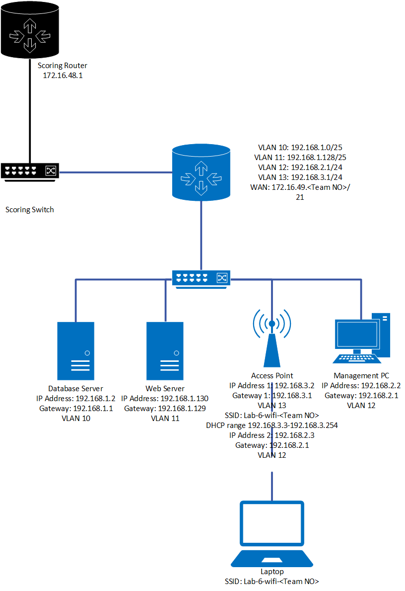

# IT&C 247 - Lab 6 - Physical Networks

## Introduction

In this lab, you will set up a small network from scratch. You will be provided with all the necessary hardware, but you will need to create your own cables. Your network will include the following devices:

- **Database Server**
- **Web Server**
- **Switch**
- **Access Point**
- **Router**
- **Management PC**
- **Laptop**

Detailed specifications for each device and service can be found below. Although each device comes with the required operating system already installed, you will be responsible for performing all configurations.

You will work in teams of 2-3. To further test your research, troubleshooting, and technical reading comprehension skills, you will not receive specific commands or instructions beyond the functional requirements of the network, other than the web and database servers. This approach simulates the real-world challenges a network engineer would face. You may refer to online resources for any additional information you need but you may not confer with other teams. You may ask for clarifications from the TAs when needed. By the end of this lab, you will have a fully functional network, demonstrating your ability to manage and configure network hardware and software.

## Objectives

1. **Assemble Network Hardware**
   - Identify and organize all provided hardware components.
   - Create custom network cables as needed.

1. **Configure Network Devices**
   - Database Server: Set up and configure to serve database functions.
   - Web Server: Set up and configure to serve web content.
   - Switch: Configure for optimal network traffic management.
   - Access Point: Set up for wireless connectivity.
   - Router: Configure for network routing and internet access.
   - Management PC: Set up for network management and monitoring.
   - Laptop: Connect to the network and test configurations.

1. **Understand Device Specifications**
   - Review detailed specifications for each device and service.
   - Ensure configurations meet the specified requirements.

1. **Collaborate Effectively**
   - Work in teams of 2-3.
   - Coordinate tasks and share responsibilities within the team.

1. **Research and Troubleshoot**
   - Utilize online resources to find necessary commands and configuration steps.
   - Apply previous lab knowledge to a new network topology.

1. **Demonstrate Technical Competency**
   - Perform all configurations without explicit step-by-step instructions.
   - Simulate real-world network engineering challenges.

1. **Verify Network Functionality**
   - Ensure all devices are properly connected and configured.
   - Test the network to confirm it is fully functional.

1. **Document Configurations**
   - Record all configuration steps and settings.
   - Prepare documentation for future reference and troubleshooting.

<div style="page-break-after: always"></div>

## Topology

This is the topology of the network you will be building. You will be setting up everything in blue, all devices in black will be managed by the TAs.



<div style="page-break-after: always"></div>

## Network Setup 

Each team will be given:

    - 4x Desktop Computers (1x for the router, 1x for the Webserver, 1x for the Database Server and 1x for the Management PC) 
    - 1x Managed Switch 
    - 25ft Cat 5e cable
    - Custom longer ethernet cable for the router to the distro switch 
    - 1x 8GB USB 
    - 1x Crimper 
    - 1x cable cutter
    - 17x RJ45 Ends 
    - 1x Console Cable

The credentials to all the devices will be `itc247:itc247`

### Cables 

One of your 1st tasks will be to create all the ethernet cables. You will have to make a total of 8 cables or varying lengths to suit your setup. The cables will be used to connect:

- Database server to switch
- Web server to switch
- Access Point to switch
- Management PC Access Point to switch
- Router to switch
- Switch to distro Switch
- Router to patch panel
- Patch panel to distro switch

Your cables will be scored on 3 different criteria: 
- The cable passes a standard test of each of the 8 wires
- The wire shielding is at or passes the strain latch
- Cable contact with the gold pins, all cables must be in full contact with the entire gold pin
- You will also be awarded 10 points for each RJ45 end that is returned after all cables have been made 

<div style="page-break-after: always"></div>

### Switch 

Your switch must be configured to the following criteria: 
- Contain VLANS 10, 11, 12, and 13
- Configure port 0/1 for the router to allow only VLANs 10,11,12 and 13
- Configure port 0/2 for the Database server to VLAN 10
- Configure port 0/3 for the Web server to VLAN 11
- Configure port 0/4 for the access point to have the native VLAN 12 and management VLAN to 13
- Configure port 0/5 for the management PC to VLAN 12
- Disable all non-used ports
- Set a switch password
- Set up SSH on the switch
- Enable port security on each needed port so only that device’s MAC address can use the switch

### Router 

Your router will be preconfigured with a default installation of OPNsense. You will need to configure it to match the network diagram. In this case, your WAN IP address will be 172.16.0.<Team number>/24. The upstream gateway for the WAN interface will be 172.16.0.10. 

You will need to set up each VLAN with its own interface, name, subnet, and gateway. The values are:

| VLAN Number | Name | Subnet | Gateway |
| - | - | - | - | 
| 10| Database    | 192.168.1.0/25   | 192.168.1.1   |
| 11| Web servers | 192.168.1.128/25 | 192.168.1.129 |
| 12| Management  | 192.168.2.0/24   | 192.168.2.1   |
| 13| WIFI        | 192.168.3.0/24   | 192.168.3.1   |

You will also need to enable NAT and DHCP for any VLANS that require it. 

**Tips:**
- The connection from your switch to your router is trunked. You'll need to configure your router to accept all VLANs on the trunk. Note that OPNsense only allows one VLAN per interface.
- Once the LAN is set up, you can access the web GUI to complete the remaining configurations.
- Firewall rules are applied to interfaces, but keep in mind that "in" doesn't always mean incoming, and "out" doesn't always mean outgoing.
- For the WAN interface, make sure to uncheck the box labeled "Block private networks."

<div style="page-break-after: always"></div>

The firewall rules should be set as follows:

- **WIFI VLAN**
    - Allow all outbound traffic to public IP addresses.
    - Can reach the Web server IP on ports 80 and 443 using TCP.
    - Block all other traffic.
- **Database VLAN**
    - Allow all outbound traffic to public IP addresses.
    - Block all outbound traffic to private IPs outside of the Database VLAN.
    - Block all inbound traffic.
- **Web VLAN**
    - Deny all other inbound traffic.
    - Allow outbound traffic to the Database server on the MariaDB port.
    - Allow all outbound traffic to public IP addresses.
    - Block all outbound traffic to private IPs outside of the Web VLAN.
    - The web server can be accessed from the WAN IP address on ports 80 and 443.
- **Management VLAN**
    - Allow outbound traffic for SSH to the Web server and Database server VLANS.
    - Allow outbound traffic for ping to all VLANs.
    - Allow outbound traffic to the internet
    - Allow outbound traffic to the web server on ports 80, 443 and 22 TCP
    - Allow outbound traffic to the database server on port 3306 and 22
    - Block all other outbound traffic.
    - Deny all other incoming traffic.

<div style="page-break-after: always"></div>

### Database Server

Run these commands to set up your database server. Since this is not a database class the TAs will assist if needed in getting your database setup. 

1. To begin update your machine and install the SQL server. We will use MariaDB for our SQL server.
    ```bash
    sudo apt update -y && sudo apt install mariadb-server -y
    ```

1. MariaDB comes with a script that helps you improve the security of your MariaDB installation. Run this script to set a root password, remove anonymous users, disallow root login remotely, and remove test databases.

    ```bash
    sudo mysql_secure_installation
    ```

    You will be prompted with several questions. It's generally recommended to answer `Y` (yes) to all questions to improve the security of your MariaDB installation.

1. Ensure that the MariaDB service is started and will start automatically at boot.

    ```bash
    sudo systemctl start mariadb && sudo systemctl enable mariadb
    ```

1. Check the status of the MariaDB service to ensure it's running correctly.

    ```bash
    sudo systemctl status mariadb
    ```

    You should see an output indicating that the service is active (running).

1. Log in to the MariaDB server as the root user to verify the installation.

    ```bash
    sudo mariadb
    ```

    You should see the MariaDB prompt (`MariaDB [(none)]>`), indicating that you have successfully logged in.

    <div style="page-break-after: always"></div>    

1. Create a new database and a user with permission to access it, follow these steps:

    1. Create a new database:
        ```sql
        CREATE DATABASE betterblog;
        ```

    1. Create a new user and grant it permissions on the database:
        ```sql
        CREATE USER 'betterblog'@'%' IDENTIFIED BY 'Fraying3-Bring-Rebuff';
        GRANT ALL PRIVILEGES ON betterblog.* TO 'betterblog'@'%';
        FLUSH PRIVILEGES;
        ```

    1. Exit the MariaDB prompt:
        ```sql
        EXIT;
        ```

1. Using a flash drive, import the database from the `database.sql` file
    ```bash
        mariadb -u root -p betterblog < /path/to/file.sql
    ```

<div style="page-break-after: always"></div>

1. To allow remote connections, you may need to edit the MySQL configuration file.

    1. Open the MariaDB configuration file:
        ```bash
        sudo nano /etc/mysql/mariadb.conf.d/50-server.cnf
        ```

    1. Find the line containing `bind-address` and change its value from `127.0.0.1` or whatever value is there to `0.0.0.0`:
        ```bash
        bind-address = 0.0.0.0
        ```

    1. Save the file and exit the editor.

    1. Restart MariaDB to apply the changes:
    ```bash
    sudo systemctl restart mariadb
    ```

1. From your database machine, test the remote connection to ensure it works.

    ```bash
    mariadb -u betterblog -p -h 192.168.1.2
    ```

You should be prompted for the password of `betterblog`. If everything is set up correctly, you will be connected to the MariaDB server.

<div style="page-break-after: always"></div>

### Web Server 

Run these commands to set up your web server. Since this is not a web class the TAs will assist if needed in getting your database setup. 

1. Start by installing the web server software
    ```bash
    sudo apt update -y && sudo apt install apache2 -y
    ```
1. Install PHP and the necessary PHP modules.

    ```bash
    sudo apt install php libapache2-mod-php php-mysql -y
    ```
1. Create a directory for your website in the `/var/www` directory.

    ```bash
    sudo mkdir /var/www/betterblog
    ```
1. Set the ownership of the directory to the Apache user.

    ```bash
    sudo chown -R www-data:www-data /var/www/betterblog
    ```
1. Copy over the betterblog files that you were given on the USB drive and place them in `/var/www/betterblog`

    ```bash
    cp -r <filepath to usb> /var/www/betterblog
    ```

1. Create a new virtual host configuration file for your website.

    ```bash
    sudo nano /etc/apache2/sites-available/betterblog.conf
    ```

    <div style="page-break-after: always"></div>

1. Add the following configuration to the file:

    ```apache
    <VirtualHost *:80>
        ServerAdmin webmaster@localhost
        ServerName betterblog.com
        DocumentRoot /var/www/betterblog

        <Directory /var/www/betterblog>
            Options Indexes FollowSymLinks
            AllowOverride All
            Require all granted
        </Directory>

        ErrorLog ${APACHE_LOG_DIR}/error.log
        CustomLog ${APACHE_LOG_DIR}/access.log combined
    </VirtualHost>
    ```
1. Save the file and exit the editor.
1. Enable the new virtual host configuration.

    ```bash
    sudo a2ensite betterblog
    ```
1. Disable the default site if you no longer need it.

    ```bash
    sudo a2dissite 000-default
    ```
1. Reload Apache to apply the changes.

    ```bash
    sudo systemctl reload apache2
    ```
1. Within the `/var/www/betterblog` files, edit the `config.json` to have the following values
    ```json
    "database_host": "192.168.1.2",
    "database_user": "betterblog",
    "database_password": "Fraying3-Bring-Rebuff",
    ```
1. Open a web browser and navigate to `http://192.168.1.130`. You should see the betterblog website, indicating that your PHP website is being served correctly by Apache.

<div style="page-break-after: always"></div>

### Access Point

Unlike the APs you have been using in Cisco packet tracer that only support one VLAN the APs you will be working with support multiple VLANs.  

You will create 1 SSID that will broadcast on VLAN 13 and allow access to the management interface over VLAN 12 using the physical cable, not WIFI. You will also need to set a strong password and encryption for the VLAN 13 SSID.

**Tip:**
- You will need to set a trunked VLAN and a native VLAN for the traffic. One will be used for management and the other for general WI-FI use.

### Management PC

This machine just needs to be set up with the correct network settings. You can also use it to help you manage the network and set up different systems. 

### Laptop

You'll need to use your own laptop for this part. The machine just needs to be set up with the correct network settings. You can also use it to help you test different firewall rules and setups. You'll also need it to set up the access point.

<div style="page-break-after: always"></div>

## TA Pass Off Requirements

- **Cables**
    - All 6 cables meet the specified requirements.

- **Router**
    - Each VLAN has its own interface and is correctly named.
    - Each interface has the correct subnet and gateway assigned to it.
    - NAT is enabled on the router.
    - VLAN 13 has DHCP enabled and the correct DHCP range set.
    - **Firewall**
        - **WIFI VLAN**
            - Allow traffic to anything on the internet
            - Allow traffic to the Web server IP on ports 80 and 443 using TCP.
            - Block all other traffic.
        - **Database VLAN**
            - Allow all outbound traffic to public IP addresses.
            - Block all outbound traffic to private IPs outside of the Database VLAN.
            - Block all inbound traffic.
        - **Web VLAN**
            - Allow inbound traffic on ports 80 and 443 using TCP from anywhere.
            - Deny all other inbound traffic.
            - Allow outbound traffic to the Database server on the Mariadb port.
            - Allow all outbound traffic to public IP addresses.
            - Block all outbound traffic to private IPs outside of the Web VLAN.
            - The web server can be accessed from the WAN IP address on ports 80 and 443.
        - **Management VLAN**
            - Allow outbound traffic for SSH to the Web server and Database server.
            - Allow outbound traffic for ping to all VLANs.
            - Allow outbound traffic to the database server on port 3306
            - Allow the router management 
            - Block all outbound traffic to private IPs outside of the Management VLAN.
            - Allow all other outbound traffic.
            - Port forward SSH from the WAN IP to the Management PC
            - Deny all other incoming traffic.
            

<div style="page-break-after: always"></div>

- **Switch**
    - Contains VLANs 10, 11, 12, and 13 in the VLAN database.
    - Access and trunk ports have been correctly configured to specifications.
    - Unused ports have been disabled.
    - A Password has been set.
    - Port security has been set on all access ports.
    - The native VLAN is correct for the access point.

- **Database**
    - MariaDB has been installed.
    - A user for the website has been created.
    - The database contains the provided tables and data.
    - Has the correct IP address, gateway, subnet mask, and DNS server.

- **Website**
    - Apache2 has been installed.
    - The website is functioning without any errors.
    - Has the correct IP address, gateway, subnet mask, and DNS server.

- **Access Point**
    - The access point is broadcasting the correct SSID.
    - The management interface can be accessed through 192.168.2.3 from the Management PC.
    - Connecting to the SSID provides a DHCP address.
    - Proper encryption has been used.
    - Proper passwords have been used.

- **Management PC**
    - Has the correct IP address, gateway, subnet mask, and DNS server.
    - Can access the website on ports 80 and 443.
    - Can SSH into the database and web servers.
    - Can ping the database and web servers.

- **Laptop**
    - Has the correct IP address, gateway, subnet mask, and DNS server.
    - Can access the website on ports 80 and 443 and can ping the database and web servers
    - Cannot SSH into the database and web servers.

## Lab Submission

- This lab will be passed off in person with a TA and there is no required write-up for this lab.


